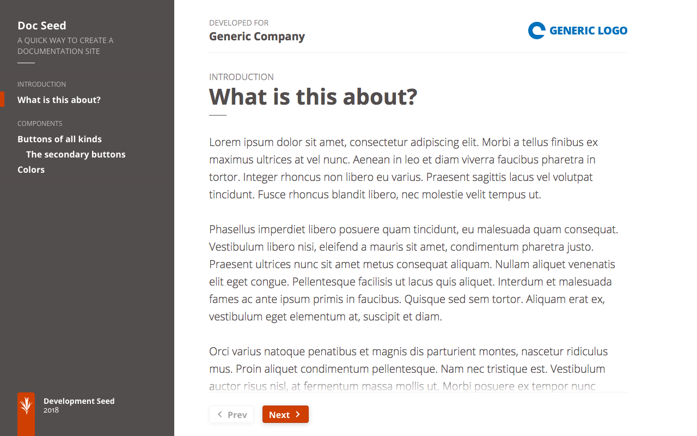
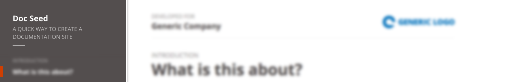
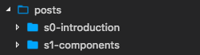
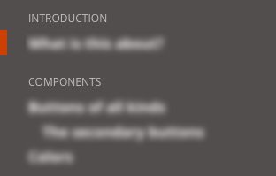
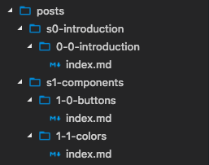
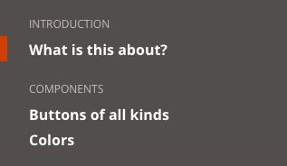
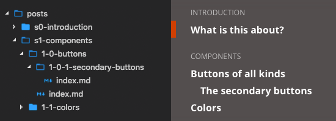

<h1 align="center">Doc Seed</h1>

Doc seed is a quick way to create a documentation site that can run on any webserver.



## Installation and Usage

The steps below will walk you through setting up your own instance of Doc Seed

### Install Project Dependencies
To set up the development environment for this website, you'll need to install the following on your system:

- [Node](http://nodejs.org/) v8 (To manage multiple node versions we recommend [nvm](https://github.com/creationix/nvm))
- [Yarn](https://yarnpkg.com/) Package manager

### Install Application Dependencies

If you use [`nvm`](https://github.com/creationix/nvm), activate the desired Node version:

```
nvm install
```

Install Node modules:

```
yarn install
```

## Configuration of Doc Seed
According to the build environment different config files may be loaded, but all of them override `_config.js`

- `_config-staging.js` is loaded for the staging environment
- `_config-dev.js` is loaded whenever it exists. This file is gitignored and should only be used during development.

The base structure of a config file is:
```
{
  baseurl: 'http://devseed.com/doc-seed',
  title: 'Doc Seed',
  description: 'A quick way to create a documentation site',

  attribution: {
    role: 'Developed for',
    name: 'Generic Company',
    logo: 'generic-logo-pos-hor.svg',
    url: 'https://developmentseed.org'
  },

  sectionsMeta: {
    's0-introduction': 'Introduction',
    's1-components': 'Components'
  }
}
```

**baseurl**  
The url where the site will live, without trailing slash. This is important for using with images and internal links. (See section [Writing Posts](#writing-posts))

**title** and **description**  
The title and description of the documentation site. It will appear on the right side



**attribution**  
If the documentation site is for a client it may be a good idea to include a page header with the client's information.


**sectionsMeta**  
Used to define the labels for each section of the website. (See section [Structure and Navigation](#structure-and-navigation)

## Structure and Navigation
The content of the site goes inside `app/posts` and is divided by section. Here each folder corresponds to a section for which a label must be defined in the config file.
This will result in section titles rendered in the sidebar.

For example, the following section folders:



With the following config (placed in the `_config.js` file):
```
sectionsMeta: {
  's0-introduction': 'Introduction',
  's1-components': 'Components'
}
```
would result in



Then, inside each section folder we create a new folder, with a single markdown file, for each post we want.
The following folder structure:



would result in



The navigation is rendered and ordered alphabetically so it is a good idea to prefix the folder names with a number to ensure the order.

Doc Seed also supports nested pages. To add a nested page just create a new folder with the markdown file under the desired parent. This will appear indented in the navigation:



The urls for each post are created from the section name and the title property defined in the markdown file (see [Writing Posts](#writing-posts) for info about these properties). To avoid overrides, all the posts inside a section must have different titles or their permalink must be changed using the correct property.

## Writing Posts
The posts are written in [markdown](https://daringfireball.net/projects/markdown/syntax) but `html` is also supported if needed.
For a post to be processed by Doc Seed it needs to include the `YAML frontmatter` which is the information between the `---` (triple dashes).

Example:
```
---
title: The post title
date: 2012-12-07
layout: post.html
---

Content of the post goes here
```

The properties defined in the `frontmatter` allow us to control how the post is rendered.

**title**  
Title of the post displayed in the navigation and as a heading in the post page.

**date**  
Publication date.

**layout**  
Used by Doc Seed to know which layout to use. **Must always be `post.html`**

**permalink**
Allows us to override the default generated url for a post. To set a page as the entry point for the documentation site use `permalink: '/'` 

#### Using variables
It is possible to used variables defined in the config directly in the markdown file.
To render a variable just use the following syntax `{{varName}}`. This is very useful when including images which should always have the full url:
```

```

### Starting the app

```
yarn run serve
```
Compiles the sass files, javascript, and launches the server making the site available at `http://localhost:3000/`
The system will watch files and execute tasks whenever one of them changes.
The site will automatically refresh since it is bundled with livereload.

# Deployment
To prepare the app for deployment run:

```
yarn run build
```
This will package the app and place all the contents in the `dist` directory.
The app can then be run by any web server.
